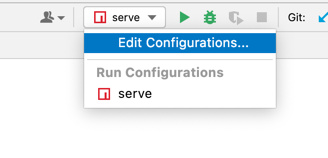
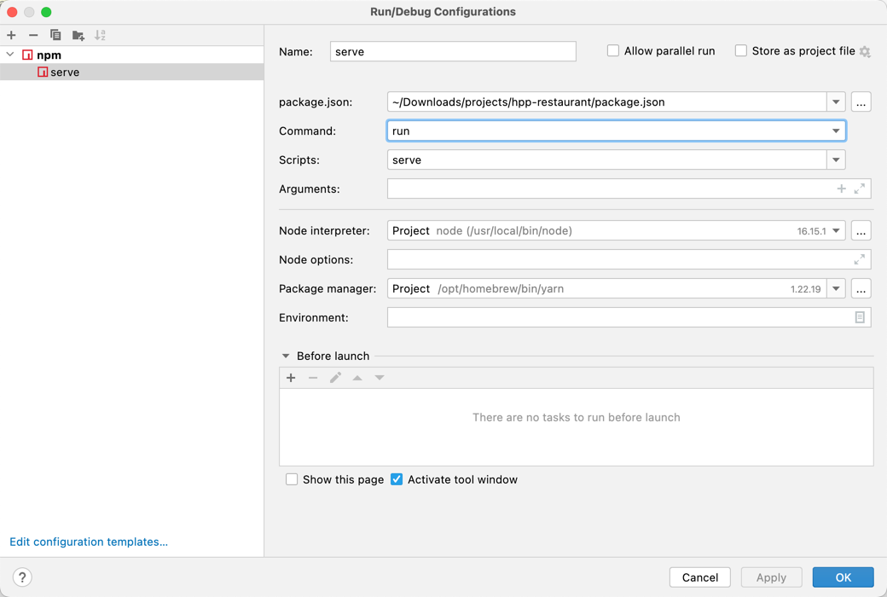

# hpp-restaurant
数据库课程设计 
在线点餐系统 前端

项目主要基于Vue2.x和element-ui组件

## Project setup
方法一：使用yarn来安装，配置好yarn后，直接运行下面这行：
```
yarn install
```
方法二：使用npm来安装（如果方法一不行，建议采用这种方法）

环境配置可以参考：https://blog.csdn.net/ChinaDragon10/article/details/135937621

ps：注意vue的安装版本，别装成vue3.x

### Compiles and hot-reloads for development

如果使用的是webstorm，在右上角运行键旁边有个运行配置，按照下图这种方式进行配置：





然后点击运行即可
